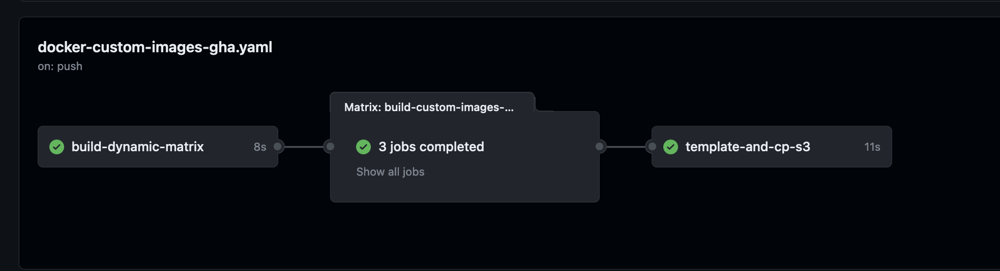

# Updating 2i2c's Singleuser Image for VEDA JH Hubs

JupyterHub configuration has the concept of a `singleuser` image that is the 
[default image for spinning up user pods](https://z2jh.jupyter.org/en/stable/jupyterhub/customizing/user-environment.html#choose-and-use-an-existing-docker-image).

Currently https://staging.nasa-veda.2i2c.cloud/ and https://nasa-veda.2i2c.cloud/ both use the custom image from this repository 
(`./docker-images/custom/nasa-veda-singleuser`) as the default. 
Below we walk through how to update this image and get it in these VEDA JH instances. This allows us to add 
custom packages without us needing to request these custom packages upstream in the `pangeonotebook` image.

## Update the Conda Environment

1. Clone this repo

2. Create a new branch `git checkout -b feature/update_package_<xyz>`

3. and open `./docker-images/custom/nasa-veda-singleuser/environment.yml`. It might look something like this: 

```yaml
channels:
  - conda-forge
  - defaults
dependencies:
  - ipykernel
  - pip
  - pip:
    - git+https://github.com/MAAP-Project/stac_ipyleaflet.git@v0.3.0
```

4. Add the pip packages or conda packages you need installed in the `dependencies` block

5. commit and push changes to the remote feature branch and create a PR

6. once the PR is merged an image building pipeline will kick off in [GH actions](https://github.com/NASA-IMPACT/veda-jh-environments/actions)



## Get sha256sum Tag of the Image

1. The image building pipeline [creates various tags](https://github.com/NASA-IMPACT/veda-jh-environments/blob/main/.github/workflows/docker-custom-images-gha.yaml#L67-L80
) for the image but the one we want to use is the sha256sum of the `environment.yml` 

2. List out the newest image tag by querying ECR with `aws-cli` where `AWS_PROFILE=uah` points to your `AWS_PROFILE` for AWS Account ID `853558080719`

```bash
$ AWS_PROFILE=uah aws ecr-public describe-image-tags --repository-name nasa-veda-singleuser --region us-east-1

{
    "imageTagDetails": [
        {
            "imageTag": "b807c7efa97c8df9ca38779f7e59d09f889fde9299b0d19de80389cf6b064f90",
            "createdAt": "2023-08-14T09:44:23.753000-07:00",
            "imageDetail": {
                "imageDigest": "sha256:d93e572d19ffa270ccbab1fa315d45e73249527d4410091688709b16408b70ad",
                "imageSizeInBytes": 2668455672,
                "imagePushedAt": "2023-08-14T09:44:22.678000-07:00",
                "imageManifestMediaType": "application/vnd.docker.distribution.manifest.v2+json",
                "artifactMediaType": "application/vnd.docker.container.image.v1+json"
            }
        },
        {
            "imageTag": "latest",
            "createdAt": "2023-08-14T09:44:24.211000-07:00",
            "imageDetail": {
                "imageDigest": "sha256:d93e572d19ffa270ccbab1fa315d45e73249527d4410091688709b16408b70ad",
                "imageSizeInBytes": 2668455672,
                "imagePushedAt": "2023-08-14T09:44:22.678000-07:00",
                "imageManifestMediaType": "application/vnd.docker.distribution.manifest.v2+json",
                "artifactMediaType": "application/vnd.docker.container.image.v1+json"
            }
        },
        {
            "imageTag": "0.0.1",
            "createdAt": "2023-08-14T09:44:23.264000-07:00",
            "imageDetail": {
                "imageDigest": "sha256:d93e572d19ffa270ccbab1fa315d45e73249527d4410091688709b16408b70ad",
                "imageSizeInBytes": 2668455672,
                "imagePushedAt": "2023-08-14T09:44:22.678000-07:00",
                "imageManifestMediaType": "application/vnd.docker.distribution.manifest.v2+json",
                "artifactMediaType": "application/vnd.docker.container.image.v1+json"
            }
        },
        {
            "imageTag": "2023-08-14",
            "createdAt": "2023-08-14T09:44:22.772000-07:00",
            "imageDetail": {
                "imageDigest": "sha256:d93e572d19ffa270ccbab1fa315d45e73249527d4410091688709b16408b70ad",
                "imageSizeInBytes": 2668455672,
                "imagePushedAt": "2023-08-14T09:44:22.678000-07:00",
                "imageManifestMediaType": "application/vnd.docker.distribution.manifest.v2+json",
                "artifactMediaType": "application/vnd.docker.container.image.v1+json"
            }
        }
    ]
}
```
3. Don't use the date, version or `latest` tag but copy the sha tag:

```bash
"imageTag": "b807c7efa97c8df9ca38779f7e59d09f889fde9299b0d19de80389cf6b064f90",
```

## Put in a PR against 2i2c's Infrastructure Repo

1. If you haven't already [clone DS's fork](https://github.com/developmentseed/infrastructure/) of [2i2c's insfrastructure repo](https://github.com/2i2c-org/infrastructure)

2. In `config/clusters/nasa-veda/common.values.yaml` you'll see the `singleuser` image block and tags. Update the tag with the `sha` from the last step and put in a [PR similar to this older example](https://github.com/2i2c-org/infrastructure/pull/2981/files)

3. Since we don't have an accessible k8s cluster to play with these new images it's best to explicitly ask in the PR to 2i2c update https://staging.nasa-veda.2i2c.cloud/ first so we can play with it and then if all looks
good we can alert them to promote it to https://nasa-veda.2i2c.cloud/

4. After the PR is in we drink some coffee and wait for 2i2c to do the work

